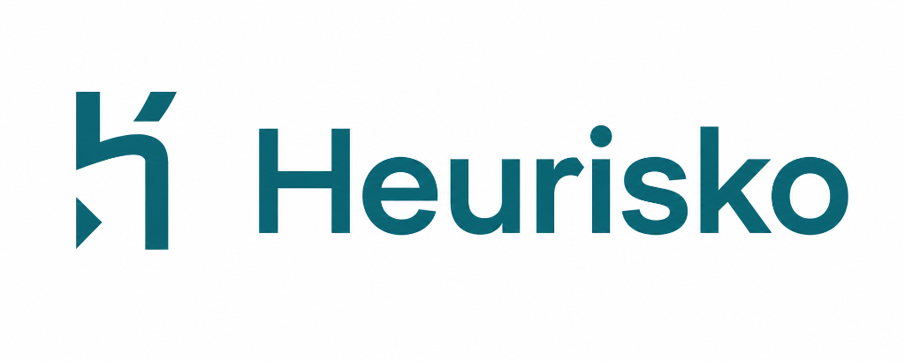
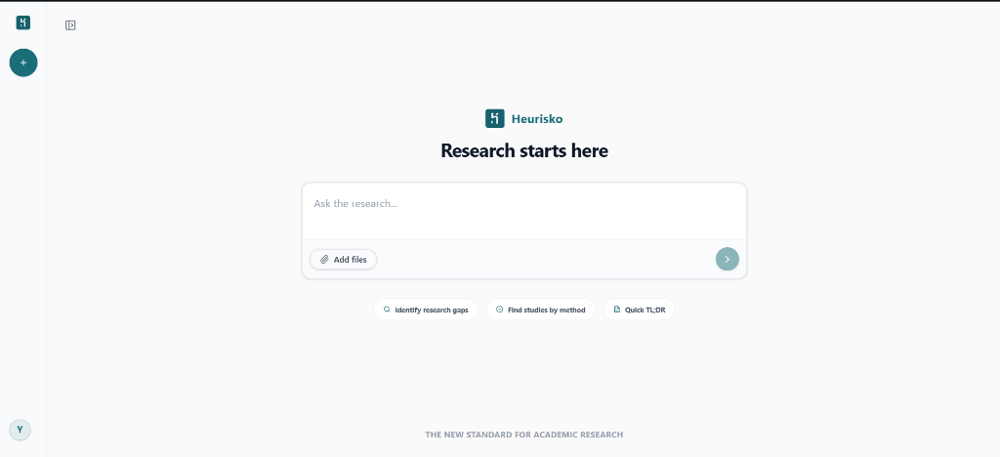
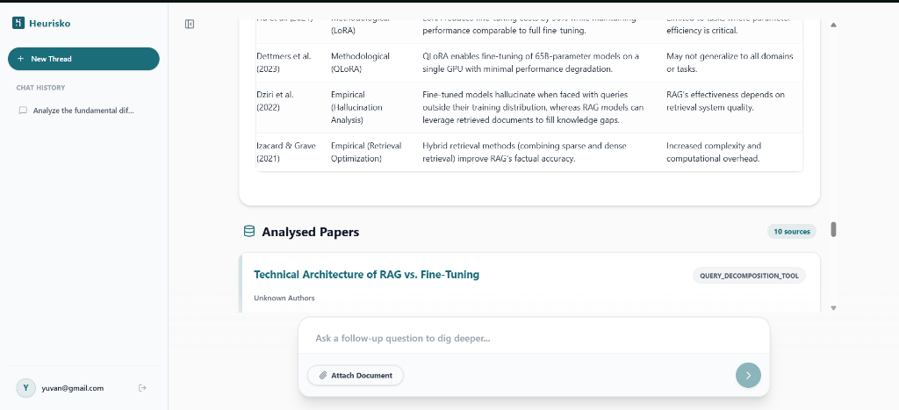
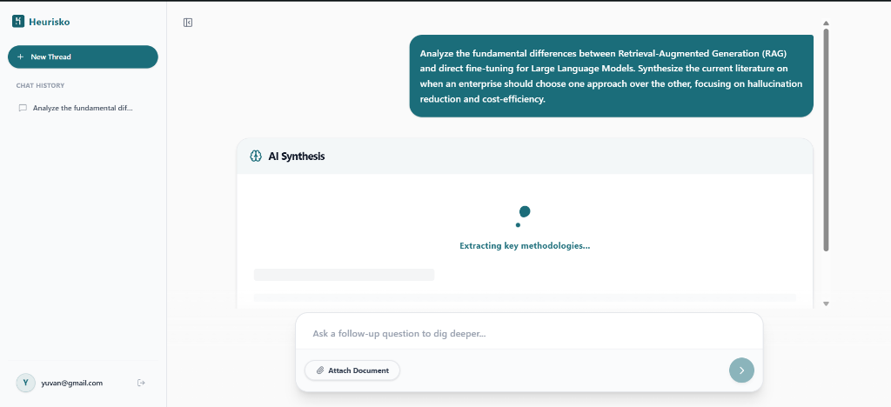
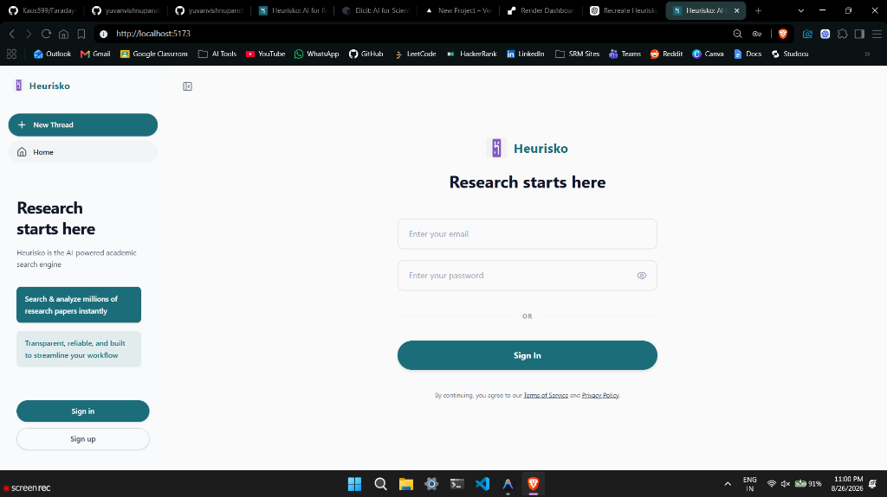
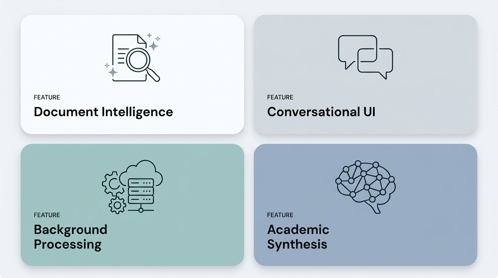
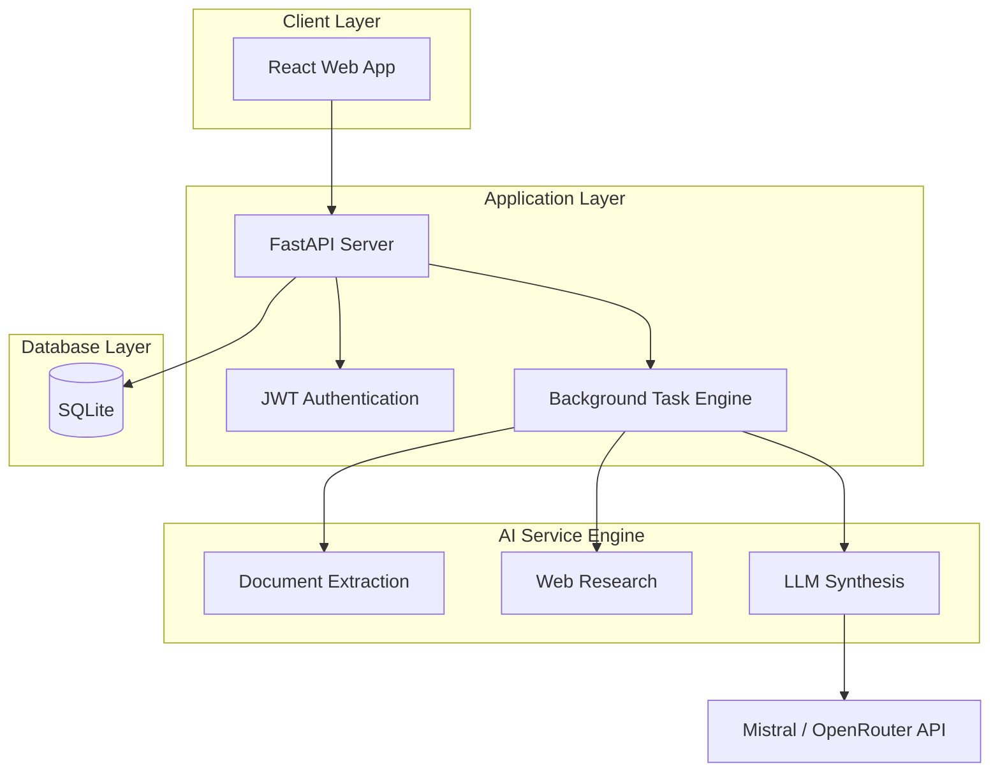
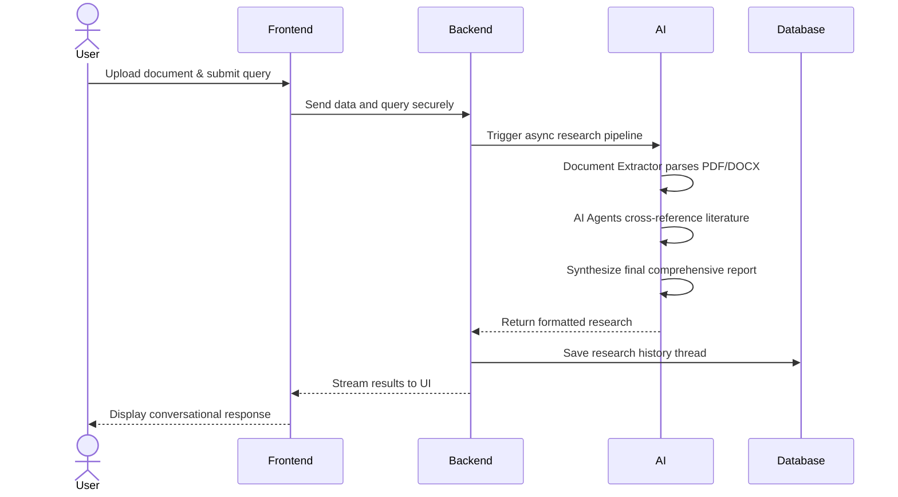

<div align="center">
  
</div>

<br />

<div align="center">
<p>An autonomous AI research assistant and academic search engine powered by multi-agent AI, offering deep document intelligence, conversational research, and real-time streaming capabilities.</p>
<br />

<p align="center"> 

<a href="https://heurisko.vercel.app/">

</a>
<a href="LICENSE">

</a>


</p>

</div>

---

<div align="center">

<table>
  <tr>
    <td></td>
    <td></td>
    
  </tr>
  <tr>
    <td></td>
    <td></td>
  </tr>
</table>

</div>

---

## What you get

<div align="center">

</div>

<details>
<summary><b>See all features</b></summary>

<table>
<tr>
<td width="50%" valign="top">

#### 🤖 AI Research Engine

- **Document Extraction** — Upload PDF, DOCX, and MD files for instant text extraction and synthesis.
- **Background Processing** — Complex queries are offloaded to asynchronous backend tasks to keep the UI fluid.
- **Deep Synthesis** — The AI scours academic literature and cross-references it with your uploaded documents.

</td>
<td width="50%" valign="top">

#### 💬 Conversational UI

- **Context-Aware Threads** — Dedicated chat interface that remembers your history using database-persisted threads.
- **Instant Streaming** — Token-by-token streaming from the language model for a fast, native feel.
- **Rich Formatting** — Fully supports Markdown, citations, and comprehensive research reports.

</td>
</tr>
<tr>
<td width="50%" valign="top">

#### 🔐 Secure Authentication

- **JWT Authentication** — Fast, secure login and registration system.
- **Data Persistence** — All chat histories and documents are securely saved to a relational database.

</td>
<td width="50%" valign="top">

#### ✨ Premium Design

- **Consensus Aesthetics** — Designed with a premium, clean layout inspired by modern academic tools.
- **Responsive PWA** — Looks stunning on Desktop, Tablet, and Mobile with zero scrollbar cutoffs.

</td>
</tr>
</table>

</details>

<br />

## Get started

```bash
git clone https://github.com/yuvanvishnupandi/heurisko.git
cd heurisko
```

Configure your local database and environment variables, then start the FastAPI backend and Vite frontend (see [Local Setup](#local-setup) below).

<br />

## 🛠️ Tech Stack

<table align="center">
<tr>
<td align="center" width="150">
<a href="https://react.dev">
<br><br>
<b>React</b>
</a>
</td>

<td align="center" width="150">
<a href="https://vitejs.dev">
<br><br>
<b>Vite</b>
</a>
</td>

<td align="center" width="150">
<a href="https://python.org">
<br><br>
<b>Python</b>
</a>
</td>

<td align="center" width="150">
<a href="https://fastapi.tiangolo.com">
<br><br>
<b>FastAPI</b>
</a>
</td>
</tr>

<tr>
<td align="center" width="150">
<a href="https://sqlite.org">
<br><br>
<b>SQLite</b>
</a>
</td>

<td align="center" width="150">
<a href="https://www.sqlalchemy.org/">
<br><br>
<b>SQLAlchemy</b>
</a>
</td>

<td align="center" width="150">
<a href="https://tailwindcss.com">
<br><br>
<b>Tailwind CSS</b>
</a>
</td>

<td align="center" width="150">
<a href="https://jwt.io">
<br><br>
<b>JWT</b>
</a>
</td>
</tr>

<tr>
<td align="center" width="150">
<a href="https://openrouter.ai">
<br><br>
<b>OpenRouter</b>
</a>
</td>

<td align="center" width="150">
<a href="https://vercel.com">
<br><br>
<b>Vercel</b>
</a>
</td>

<td align="center" width="150">
<a href="https://github.com">
<br><br>
<b>GitHub</b>
</a>
</td>

<td align="center" width="150">
<a href="https://postman.com">
<br><br>
<b>Postman</b>
</a>
</td>
</tr>
</table>

<br><br>

---

<h2 id="architecture">🏛️ Overall system architecture</h2>

The application follows a modern decoupled architecture consisting of a React presentation layer and a FastAPI backend with SQLite persistence. Background tasks handle expensive AI operations asynchronously.



<br />

## Diagnostic processing workflow

The following sequence diagram illustrates how a research query is processed from submission to the final synthesized report.



<br />

## Core data flow

1. User uploads a research document or enters an academic query.
2. The React frontend forwards the request to the FastAPI backend.
3. The Document Extractor safely converts binary files to readable text.
4. The Research Agents query LLMs and web sources to find literature.
5. The processed research report is stored in SQLite.
6. The user receives a comprehensive, conversational AI response.

<br />

<h2 id="multi-agent-ai-engine">🧠 Autonomous Research Engine</h2>

The AI service is designed as a collection of specialized agents. Each agent performs a dedicated task, allowing the system to process large academic queries in a structured manner.

<details>
<summary><b>See all agents</b></summary>

<br />

- **Document Extractor**
  - Securely parses binary `.pdf` and `.docx` files to extract raw academic text.

- **Research Engine**
  - Autonomous agents that search literature, synthesize data, and summarize findings.

- **Conversation Manager**
  - Manages chat state, remembers previous threads, and formats responses in clean Markdown.

</details>

<br />

<h2 id="local-setup">🚀 Local setup</h2>

### Prerequisites

- Node.js 18 or later
- Python 3.9 or later

### Clone repository

```bash
git clone https://github.com/yuvanvishnupandi/heurisko.git
cd heurisko
```

<details>
<summary><b>Backend setup</b></summary>

```bash
# From the root directory
pip install -r requirements.txt
uvicorn research_system.api.main:app --reload
```

</details>

<details>
<summary><b>Frontend setup</b></summary>

```bash
cd frontend
npm install
npm run dev
```

</details>

<br />

<h2 id="environment-variables">Environment variables</h2>
<details>
<summary><b>Full reference</b></summary>

<br />

| Variable | Description | Where |
|----------|-------------|-------|
| `OPENROUTER_API_KEY` | API Key for LLM access | Root `.env` |
| `API_URL` | Base URL the frontend uses to call the backend API | Root `.env` |

</details>

<br />


## Data & storage

- **Database** — SQLite Local Database
- **Hosting** — Frontend on Vercel, Backend on Render

<br />

## License

Heurisko is [MIT licensed](LICENSE).
